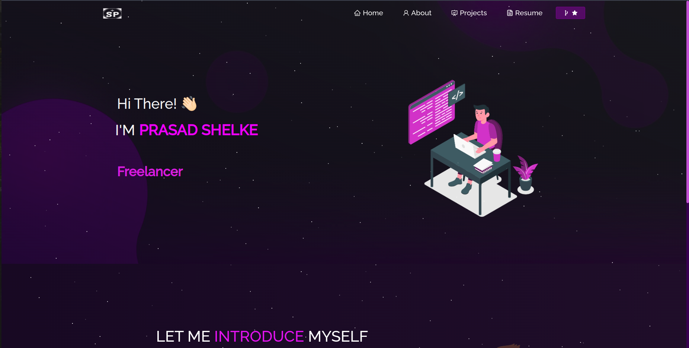

# [Prasad]'s Portfolio
[Visit My Portfolio]([https://stories.pythonanywhere.com/](https://prasaddshelke.netlify.app/))

Welcome to my personal portfolio! This repository serves as a showcase of my skills, projects, resume, and GitHub account.

## About Me
Briefly introduce yourself and your background.

## Skills
List your skills here, such as programming languages, frameworks, tools, etc.

## Projects
Provide links and descriptions of your notable projects. You can include screenshots or gifs if applicable.

## Resume
Link to your resume or provide a brief overview of your experience and qualifications.

## GitHub
Link to your GitHub account so visitors can explore your repositories.

Feel free to explore this repository and reach out to me if you have any questions or collaboration opportunities!

